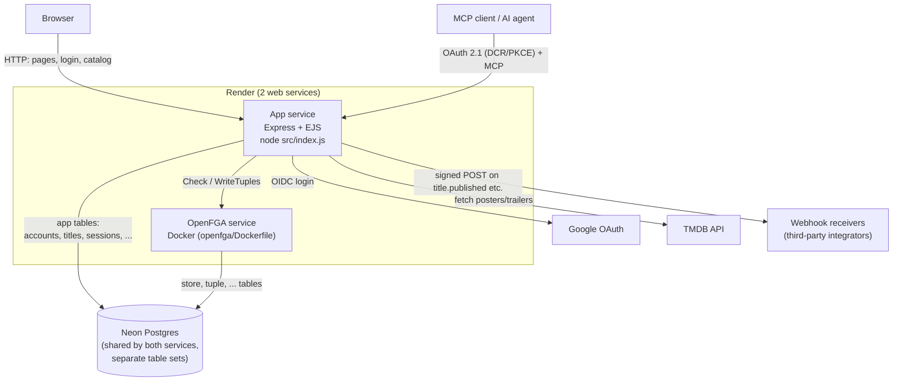

# COMICS TV

A Marvel/DC streaming platform built on Express, EJS, and Postgres, with a hand-rolled
OAuth 2.1 authorization server, OpenFGA-based fine-grained authorization, an MCP server,
and Google SSO.

## Table of contents

- [Features](#features)
- [Architecture](#architecture)
- [Authorization (OpenFGA)](#authorization-openfga)
- [Requirements](#requirements)
- [Setup](#setup)
- [Environment variables](#environment-variables)
- [Running the app](#running-the-app)
- [Useful scripts](#useful-scripts)
- [Deployment](#deployment)

## Features

- **Catalog**: a real Marvel/DC movie catalog with TMDB-sourced posters and trailers,
  search, pagination, and a per-user watchlist.
- **Authentication**: email + password signup/login (username auto-generated from the
  email), Google SSO with account linking by verified email, and session/device
  management (list active sessions with city-level location, sign out individually or
  everywhere).
- **OAuth 2.1 authorization server**: hand-written (no third-party IdP or OAuth library)
  authorize/token/introspect/revoke/JWKS endpoints, PKCE (S256 only), refresh token
  rotation with reuse detection, and RFC 7591 Dynamic Client Registration.
- **MCP server**: a Model Context Protocol server mounted behind the OAuth 2.1 server,
  for AI agents to interact with the catalog under scoped, user-consented access.
- **Authorization**: OpenFGA (self-hosted) enforces fine-grained, per-object permissions
  (who can discover, play, or publish a title) on top of the OAuth scope layer.
- **Webhooks**: signed, retried outbound webhook deliveries for third-party integrators.
- **Theming**: a light/dark mode toggle, persisted server-side via a cookie (no flash of
  the wrong theme on load).

## Architecture



The app and OpenFGA are two independently deployed Render services that happen to
share one Postgres instance — each owns its own tables (see
[Authorization (OpenFGA)](#authorization-openfga) and [Deployment](#deployment)).
Neither service can reach the other's tables; the only interaction between them is
the OpenFGA HTTP API (`Check`/`WriteTuples`) that the app calls at request time.

```
src/
  app.js               Express app factory (helmet, sessions, CSRF, rate limiting)
  index.js             Entry point, graceful shutdown, webhook delivery loop
  config/              Environment variable loading/validation
  db/                  Postgres connection pool + transaction helper
  repositories/        Only place raw SQL lives
  services/            Business logic, transaction boundaries
  controllers/         Request/response glue
  routes/              Express routers
  middleware/          CSRF, rate limiting, session/device tracking, view locals
  auth/                OAuth 2.1 authorization server, Google SSO client
  authz/               OpenFGA client + permission middleware
  mcp/                 Model Context Protocol server
  webhooks/            Signing, delivery, retry logic
authz/model.fga        OpenFGA authorization model (DSL)
openfga/Dockerfile     Wraps the upstream openfga/openfga image for Render (see Deployment)
migrations/            Knex migrations (raw SQL, no ORM at runtime)
scripts/               One-off seed/backfill scripts
views/                 EJS templates
public/                Static assets, CSS, client-side JS
```

## Authorization (OpenFGA)

Permissions are relationship-based (a Zanzibar-style model via
[OpenFGA](https://openfga.dev)), not a fixed role table. Three pieces:

1. **The model** (`authz/model.fga`) — the schema. Defines each type (`user`,
   `account`, `plan`, `title`, ...) and the relations it can have, including relations
   *computed* from other relations.
2. **Tuples** — the facts, e.g. `(user:7, owner, account:7)` or `(plan:free,
   required_plan, title:52)`. These live in OpenFGA's own Postgres tables (`store`,
   `tuple`), not the app's tables — see [Deployment](#deployment) for how OpenFGA's
   datastore is configured.
3. **Check** — the runtime query: "does `user:7` have `can_play` on `title:52`?"
   OpenFGA walks the model's relation graph combining tuples until it can answer.

### The plan ladder

```
define subscriber: [account#member]
define superseded_by: [plan]
define member: subscriber or member from superseded_by
```

`member` on a plan is true for a direct `subscriber`, **or** for a member of a plan
this one supersedes. If `premium` supersedes `standard`, a premium subscriber
automatically satisfies `standard`'s `member` check with zero extra tuples — moving
someone up a tier is one tuple change, not a rewrite across every title.

### Discover vs. play

```
define published: [user:*]
define entitled: member from required_plan
define can_discover: published or editor
define can_play: (published and entitled) or editor
```

- `published: [user:*]` is a **wildcard** tuple — written once per title as
  `(user:*, published, title:X)`, satisfied by every user. This is why the homepage
  can show posters to logged-out visitors: `can_discover` only needs `published`.
- `can_play` is stricter — it also needs `entitled`, which resolves through
  `required_plan` and the plan ladder above. A title requiring `standard` denies a
  free-tier account even though they can still *discover* it (an upsell UX, not a
  bug).
- `editor` (an admin, or the platform's `content_admin`) bypasses both checks, so
  drafts are visible to staff before anyone else.

### Request flow (`src/authz/middleware.js`)

1. `fgaSubjectForRequest` / `fgaSubjectForAdminRequest` turn the session into an FGA
   subject string, `user:<accounts.id>` — the subject is the account row's id, not the
   username, so a new account needs its tuples written before anything works.
2. `requireFgaPermission(relation, objectFromReq, { tier, admin })` wraps a route,
   builds the object string (e.g. `title:${req.params.id}`), and calls `can()`.
3. **Tiered fail policy**: `tier: 'browse'` (movie details) fails *open* on an FGA
   outage — a blip shouldn't take the homepage down. `tier: 'strict'` (playback, admin
   writes) fails *closed* — if OpenFGA is unreachable, the request is denied rather
   than risk serving a licensed video or letting a write through unchecked.

Applied in `catalogRoutes.js`: `/movie/:id` → `can_discover` at `browse` tier,
`/video/:id` → `can_play` at `strict` tier, `/admin/add-movie` → `can_create_title` at
`strict` tier with `admin: true`.

### Where tuples come from

- `scripts/seed-fga-tuples.js` — bulk-backfills `owner`/`subscriber` for every existing
  account and `parent_platform`/`published`/`required_plan` for every title.
- `src/lib/accountLookup.js` — writes the same `owner`/`subscriber` tuples the moment a
  *new* account is lazily created, so a fresh signup doesn't permanently fail
  `can_play` for lack of tuples.
- Adding a title via the admin panel does **not** yet write its `published`/
  `required_plan` tuples automatically — re-run `seed-fga-tuples.js` after adding
  titles outside the seed scripts, or it won't be playable/discoverable yet.

## Requirements

- Node.js (version pinned in `.nvmrc` — `nvm use`)
- Postgres 14+ (locally, or a free hosted instance — see [Deployment](#deployment))
- Docker (to run OpenFGA locally)
- A TMDB API key (for posters/trailers)
- A Google OAuth 2.0 client ID/secret (for Google SSO)

## Setup

1. Clone the repository and install dependencies.

   ```bash
   git clone <this-repo-url>
   cd Node-JS-OTT
   npm install
   ```

2. Copy the environment template and fill in real values.

   ```bash
   cp .env.example .env
   ```

   See [Environment variables](#environment-variables) below for what each one is for.

3. Create a Postgres database and run migrations.

   ```bash
   createdb comics_tv
   npx knex migrate:latest
   ```

4. Start OpenFGA locally with Docker, pointed at its own Postgres datastore (OpenFGA
   creates its own tables — `store`, `tuple`, etc. — so it's fine to share the same
   database as the app, or use a separate one), then create a store and write the
   authorization model from `authz/model.fga`. Put the resulting store ID and model ID
   into `FGA_STORE_ID` / `FGA_MODEL_ID` in `.env`.

5. Seed the catalog and OpenFGA tuples.

   ```bash
   node scripts/seed-catalog.js
   node scripts/seed-marvel-dc.js
   node scripts/seed-marvel-dc-batch2.js
   node scripts/seed-fga-tuples.js
   ```

## Environment variables

| Variable | Purpose |
|---|---|
| `PORT` | Port the app listens on |
| `DATABASE_URL` | Postgres connection string |
| `SESSION_SECRET` | Signs the session cookie |
| `NODE_ENV` | `development` or `production` |
| `TMDB_API_KEY` | Fetches posters/trailers from TMDB |
| `FGA_API_URL` / `FGA_STORE_ID` / `FGA_MODEL_ID` | OpenFGA connection and model |
| `GOOGLE_CLIENT_ID` / `GOOGLE_CLIENT_SECRET` | Google SSO |

Never commit `.env` — it's excluded via `.gitignore`. `.env.example` documents every
variable with a placeholder value.

## Running the app

```bash
npm start   # production
npm run dev # restarts on file changes (node --watch)
```

The app listens on the port set in `PORT` (defaults to `1000`).

## Useful scripts

| Script | Purpose |
|---|---|
| `scripts/backfill-accounts.js` | Migrates legacy `users`/`admins` rows into the `accounts`/`profiles` tables |
| `scripts/seed-catalog.js` | Seeds the base movie catalog |
| `scripts/seed-marvel-dc.js` / `seed-marvel-dc-batch2.js` | Seeds the full Marvel/DC catalog |
| `scripts/fetch-tmdb-media.js` / `sync-catalog-media.js` | Pulls posters/trailers from TMDB |
| `scripts/generate-clear-posters.js` | Regenerates high-resolution poster assets |
| `scripts/backfill-credits.js` | Backfills missing cast/crew from TMDB for titles that have neither |
| `scripts/seed-fga-tuples.js` | Backfills OpenFGA authorization tuples for existing accounts/titles |

## Deployment

The app is deployed on Render, as two separate web services plus one shared external
Postgres. Render has no managed MySQL, and its private-service tier (the usual way to
self-host a database as a Docker container) requires payment info even at $0 — so both
services point at a free external Postgres instead ([Neon](https://neon.tech) here, no
card required):

- **App**: https://node-js-ott-6.onrender.com/ — Node native runtime, builds from this
  repo's root, start command `node src/index.js`.
- **OpenFGA**: https://comics-tv-openfga.onrender.com/ — Docker runtime, builds from
  `openfga/Dockerfile` with root directory `openfga`. The upstream `openfga/openfga`
  image has **no default command** (its entrypoint alone just prints help and exits),
  and Render's image-runtime service type has no reliable way to override a
  container's command via its dashboard or CLI — so this repo's Dockerfile just wraps
  the upstream image with `CMD ["run"]` baked in. Schema migrations
  (`openfga migrate`) are run as a one-off against the same image/datastore rather
  than automatically on every deploy.
- Both services set `OPENFGA_METRICS_ENABLED=false` / rely on the app's `PORT` env var
  being explicit — OpenFGA exposes three ports (HTTP API, gRPC, Prometheus metrics),
  and Render's automatic port detection can pick the wrong one if metrics are left on.
- `DATABASE_URL` (app) and `OPENFGA_DATASTORE_ENGINE=postgres` +
  `OPENFGA_DATASTORE_URI` (OpenFGA) point at the **same** Neon database — OpenFGA
  creates its own tables (`store`, `tuple`, etc.) that don't collide with the app's.
- Set every other variable from [Environment variables](#environment-variables) in
  each service's Render environment settings.
- Add both your local (`http://localhost:<PORT>/auth/google/callback`) and production
  (`https://node-js-ott-6.onrender.com/auth/google/callback`) redirect URIs to the
  Google Cloud OAuth client's authorized redirect URIs list.
